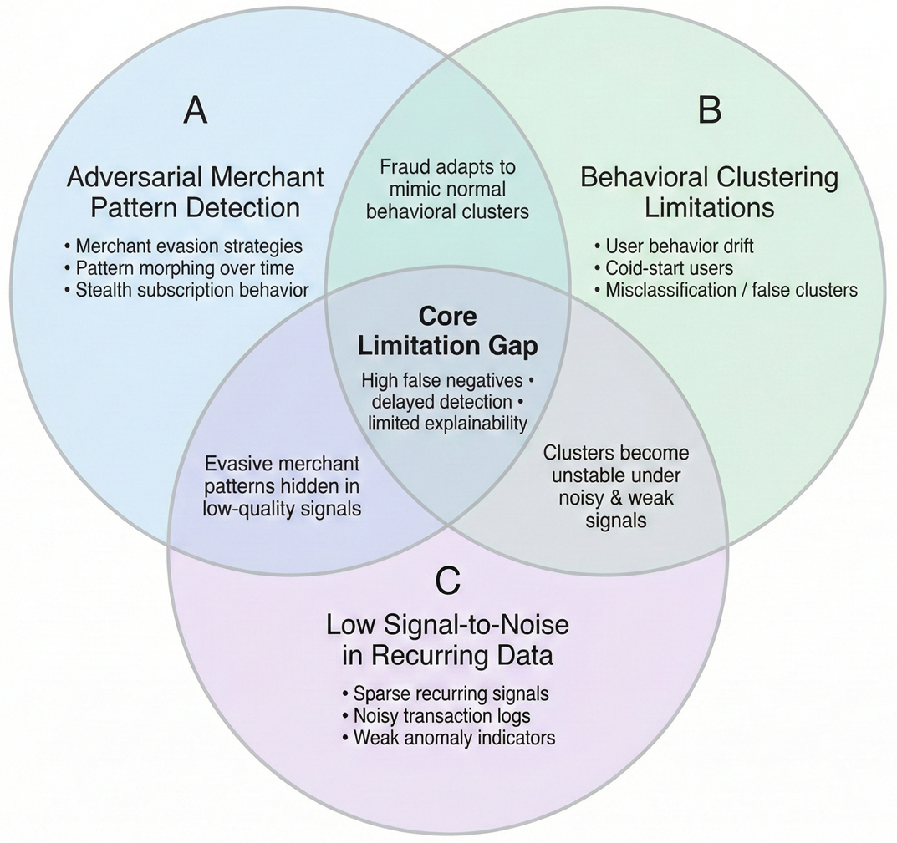
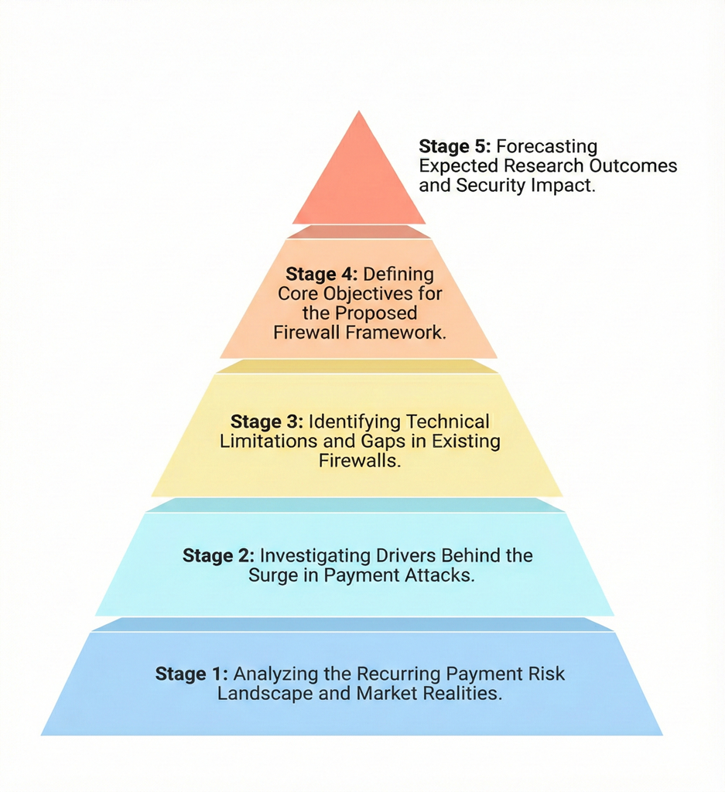
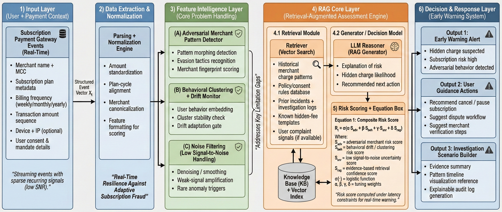
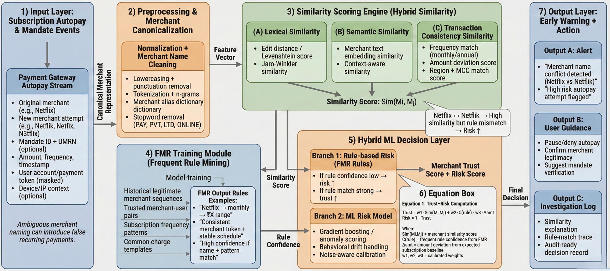
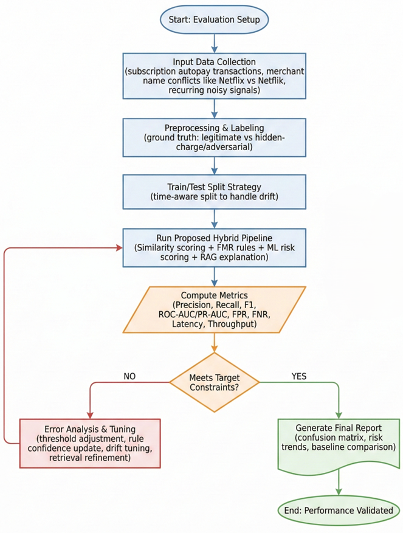
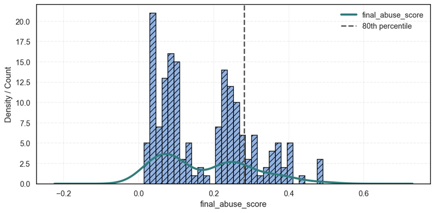
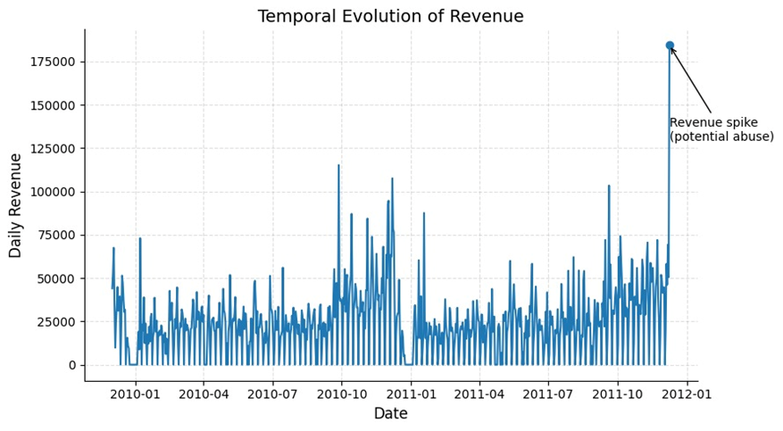
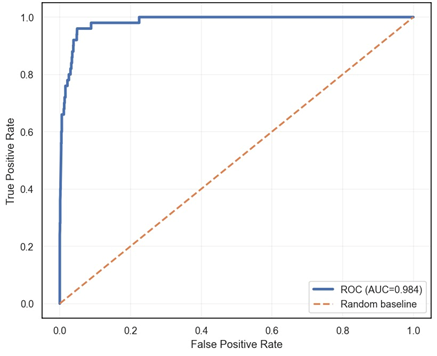
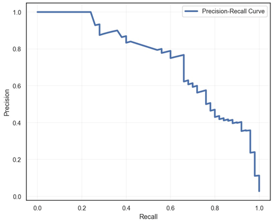

# A Novel Hybrid-RAG-Based-RFMV Adaptive Firewall for Recurring Payment Abuse Detection  
### with Merchant Behaviour Scoring (Phase-III)

## Executive Summary (Startup + VC View)
Recurring payments are rapidly becoming the dominant revenue and billing mechanism across digital commerce, streaming, SaaS, app subscriptions, and embedded-finance ecosystems. However, this shift has also expanded the attack surface for **recurring payment abuse**, where adversarial merchants and fraud actors exploit subscription-like payment flows to generate unauthorized, hidden, or persistently misleading recurring charges. Traditional controls struggle because they are often built on static rules and outdated heuristics that fail in modern environments where merchant tactics evolve continuously.

This project proposes a **Hybrid-RAG-based adaptive firewall**—a production-oriented detection approach designed to identify **suspicious recurring/autopay behaviours** and **hidden-charge patterns** with improved accuracy, explainability, and operational stability. The solution integrates:

- **Similarity-based recurrence detection**
- **FMR-based monitoring signals (drift-sensitive behavioural monitoring)**
- **Machine Learning classification**
- **Retrieval-Augmented Generation (RAG)**
- **RAG-based RFMV equation**
- **Merchant Behaviour Scoring**

The core business value is direct: **reduce false negatives**, mitigate recurring-abuse losses earlier, improve consumer trust, support compliance-driven explainability, and enable risk teams to respond faster with interpretable evidence.

---

## Team
**Team Name:** KILZCODE  
**Team Members:**
- Mr. Simar Singh Rayat  
- Mr. Sujal Thapa  
- Mr. Prins Kanyal  

---

## Startup Narrative: What We Are Building
We are building an **Adaptive Recurring-Payment Abuse Firewall**, designed for financial institutions, payment processors, subscription platforms, and fraud/risk teams. The firewall operates as a continuously learning risk layer that flags suspicious recurring payment patterns in near-real time while generating decision evidence to support auditability and operational actions.

### Product Positioning (What This Is)
This system behaves like a **fraud-grade security layer** for recurring payments, focused on:

- detecting stealthy recurring abuse patterns,
- handling rapidly evolving merchant evasion tactics,
- maintaining stability under user behavioural drift,
- and producing explainable outputs through retrieval-augmented reasoning.

### Why It Wins (Key Differentiators)
- **Adaptive by design:** does not rely solely on static thresholds.
- **Hybrid detection engine:** combines multiple detection signals (Similarity + FMR + ML + RAG).
- **Explainable detection:** RAG supports evidence-driven reasoning for decisions.
- **Merchant Behaviour Scoring:** provides a structured way to rank suspicious merchant patterns.
- **Phase-III evaluation loop:** ensures measurable targets and iterative tuning.

---

## Market Problem and Why It Is Urgent
Recurring payments have become highly profitable for legitimate businesses—but also highly profitable for adversarial actors. As recurring transaction volumes grow, the ability to hide malicious activity inside normal recurring flows increases. This creates operational problems:

- Financial risk increases due to **persistent hidden-charge abuse**.
- Customers face subscription confusion, reducing trust.
- Risk teams are overloaded with noisy signals and false alerts.
- Static rules break under merchant churn and evolving attack strategies.

This problem is intensified by:

- **Adversarial merchant evasion**
- **Frequent behavioural shifts**
- **User drift causing unstable behavioural clustering**
- **Low signal-to-noise recurring transaction streams**
- **Delayed detection → higher false negatives**

---

## Problem Statement (Technical + Business Perspective)
Adversarial merchants actively evade recurring payment detection by continuously shifting behavioural patterns, which causes conventional static-rule systems to fail. In real payment environments, merchant tactics evolve rapidly, and these frequent pattern shifts break rule-based filters that depend on stable heuristics. Additionally, behavioural clustering becomes unstable due to **user drift**, where customer payment behaviour changes over time and disrupts previously learned groupings. Another major challenge is that recurring transaction streams often contain a **low signal-to-noise ratio**, meaning malicious indicators are subtle and buried within legitimate recurring payments. As a result, detection is delayed and systems suffer from higher false negatives, allowing suspicious or hidden-charge behaviour to persist longer before being flagged.

**Figure 1 (Caption):**  
*Problem framing: adversarial merchant evasion + drift-driven instability + low signal-to-noise conditions create delayed detection and high false negatives in recurring payment monitoring.*

### Key Challenges (From PPT)
- Adversarial merchants bypass recurring payment detection  
- Patterns shift frequently, breaking static rules  
- Behavioural clustering becomes unstable due to user drift  
- Recurring transaction data has low signal-to-noise  
- Outcomes include delayed detection and higher false negatives  

---

## Core Objective (Firewall Vision)
Recurring payments are rising rapidly, and attacks on subscription and autopay systems are becoming increasingly stealthy and adaptive. Merchant patterns are designed to evade static detection, and user behaviour drift causes clusters to break, reducing long-term reliability. Therefore, the core objective is to develop an **adaptive and explainable firewall** capable of detecting recurring payment abuse and hidden-charge activity with improved reliability under evolving merchant tactics and drifting customer behaviour.

**Figure 2 (Caption):**  
*System topology view of the proposed adaptive firewall, emphasizing structured integration of hybrid detection and explainability under pattern drift.*

### Objectives of the Proposed Solution
- Support rising recurring payments and modern threat trends  
- Detect stealthy and adaptive attacks  
- Prevent merchant evasion against static detection  
- Handle user behaviour drift and cluster instability  
- Provide an adaptive and explainable detection firewall  

---

## Why a Hybrid Approach Is Required (Startup Rationale)
A single-method approach cannot reliably detect recurring payment abuse in dynamic environments. Static rules fail under drift and evasion. Pure ML models can degrade when data shifts and often face explainability gaps. Pure similarity matching can miss adversarial behaviour that intentionally “looks normal.” Therefore, this project integrates a hybrid firewall strategy that increases resilience by combining multiple complementary signals.

### Table 1 — Hybrid Components and Their Strategic Purpose
| Module | Purpose | Startup Value |
|--------|---------|--------------|
| Similarity | Detect recurrence likeness and pattern similarity | Captures subscription-like consistency and duplicates |
| FMR | Monitoring signal capturing behavioural change | Drift-sensitive detection under evolving patterns |
| ML | Classification and decision boundary learning | Detects subtle signals beyond static thresholds |
| RAG | Retrieval-augmented reasoning and explainability | Auditability and evidence-based decisions |
| Merchant Behaviour Scoring | Structured risk ranking for merchant patterns | Improves prioritization and investigation efficiency |
| RFMV (RAG-based) | Monitoring-aware feature framework | Strengthens robustness in low signal-to-noise streams |

---

## Literature Review (Evaluation Grounding)
A literature review was conducted to support evaluation design and benchmarking using widely adopted machine learning evaluation metrics, imbalance learning strategies, and diagnostic plotting approaches. The referenced works establish reliable foundations for ROC analysis, precision-recall curves under imbalanced data, synthetic over-sampling (SMOTE), balanced accuracy, and correlation-based evaluation metrics.

---

## Proposed Methodology (Phase-I): Conceptual Hybrid-RAG Architecture
Phase-I introduces the conceptual architecture for the Hybrid-RAG approach. The design frames recurring payment abuse detection as a task requiring adaptive logic and explainability. The architecture is represented as a Hybrid-RAG framework intended for malicious and hidden script assessment, reflecting the need for a structured detection pipeline that can evolve with merchant tactics and user behaviour changes.

### Figure 3 — Proposed Hybrid-RAG Architecture (Phase-I)

**Figure 3 (Detailed Caption):**  
This figure presents the Phase-I conceptual architecture of the Hybrid-RAG framework for malicious and hidden script assessment. It establishes the foundation of the firewall vision by positioning RAG as a supporting layer for contextual reasoning and explainability. The Phase-I view highlights that static detection approaches are insufficient, and a structured yet adaptable architecture is required for recurring abuse monitoring.

---

## Proposed Methodology (Phase-II): Refined Hybrid-RAG Architecture
Phase-II refines the Hybrid-RAG architecture toward an implementation-oriented view. The framework becomes more aligned with operational integration and modular detection logic. This phase communicates evolution from concept into a structured approach that supports hybrid decision-making under merchant behavioural shifts and user drift.

### Figure 4 — Proposed Hybrid-RAG Architecture (Phase-II)

**Figure 4 (Detailed Caption):**  
This figure presents the Phase-II refined Hybrid-RAG architecture for malicious and hidden script assessment. It strengthens system-level organization and improves alignment between detection stages and explainability requirements. The Phase-II architecture supports recurring abuse detection under drift conditions and reflects a clearer modular structure suitable for Phase-III execution.

---

## Proposed Methodology (Phase-III): End-to-End Execution Pipeline (Production Mindset)
Phase-III defines the full end-to-end operational workflow for the proposed Hybrid-RAG detection pipeline. This phase represents how recurring subscription and autopay transaction data is ingested, processed, analysed, and evaluated. It ensures the system detects suspicious and hidden-charge activity through hybrid integration of **Similarity**, **FMR**, **ML**, and **RAG**, while also measuring critical performance and operational readiness signals (F1 score, FPR/FNR, latency, throughput). The Phase-III validation loop formalizes iterative refinement through tuning when performance objectives are not achieved.

### Table 2 — Phase-III Pipeline Definition
| Step | Phase-III Action | Why It Matters for Deployment |
|------|------------------|------------------------------|
| Step 1 | Collect recurring autopay transaction data (including merchant name conflicts) | Real-world merchant inconsistency is common; must be handled early |
| Step 2 | Preprocess and label data (legit vs suspicious/hidden-charge) | Enables measurable evaluation and consistent classification logic |
| Step 3 | Run hybrid pipeline (Similarity + FMR + ML + RAG) | Hybrid integration increases detection reliability under drift |
| Step 4 | Compute metrics (F1, FPR/FNR, latency, throughput) | Validates both predictive accuracy and operational feasibility |
| Step 5 | Validate targets; tune and repeat | Ensures iterative stability and continuous improvement |

---

## Phase-III Workflow Flowchart
The following flowchart depicts the complete Phase-III execution structure from input transaction data to evaluation and tuning.

### Figure 5 — Phase-III Execution Pipeline Flowchart

**Figure 5 (Detailed Caption):**  
This flowchart illustrates the Phase-III end-to-end workflow for recurring payment abuse detection. It shows how recurring autopay transactions are collected (including merchant name conflicts), then preprocessed and labeled into legit versus suspicious/hidden-charge classes. The hybrid pipeline is executed using Similarity analysis, FMR monitoring signals, ML classification, and RAG-based reasoning. Performance is then measured using F1 score, FPR/FNR, latency, and throughput, followed by a validation loop in which targets are checked and the pipeline is tuned and re-evaluated when necessary.

---

## Mathematical Abbreviations (Operational and Evaluation Metrics)
This section documents key mathematical abbreviations used throughout evaluation and reporting.

### Table 3 — Metrics and Abbreviations Used
| Term | Meaning | Why It Matters |
|------|---------|----------------|
| F1 | F1 Score | Primary balanced metric for detection quality |
| FPR | False Positive Rate | Controls alert noise and customer friction |
| FNR | False Negative Rate | Controls missed abuse (high loss impact) |
| Latency | Time to decision | Determines real-time feasibility |
| Throughput | Volume processed | Ensures scalability in production |
| RAG | Retrieval-Augmented Generation | Enables explainability and evidence-driven reasoning |
| RFMV | Recency–Frequency–Monitor Value | Scoring framework used in the pipeline |
| FMR | Frequency–Monitor–Recency signal | Drift monitoring and behavioural change capture |

---

## Merchant Behaviour Scoring (Risk Ranking Layer)
Merchant Behaviour Scoring is a core analytical component used to quantify and rank merchant transaction behaviour patterns. This scoring supports differentiation of stable recurring subscriptions from suspicious or hidden-charge behaviours by capturing abnormal recurrence signals, merchant inconsistencies, and changes in transaction characteristics over time. For startup deployment, this risk ranking layer is crucial because it enables:

- prioritization of the highest-risk merchants,
- reduced analyst workload,
- and structured escalation paths for investigations.

This component aligns with the firewall objective of remaining adaptive under frequent drift and adversarial pattern modifications.

---

## RAG-Based RFMV Equation (Context-Aware Monitoring)
The system integrates a RAG-based RFMV equation approach to combine structured monitoring features with retrieval-augmented reasoning. This component supports improved context awareness for recurring payment behaviours by incorporating monitoring-style feature dynamics and strengthening interpretability through retrieval support. The RFMV representation is intended to improve robustness in scenarios where recurring transaction indicators are subtle or intentionally masked by adversarial activity.

---

## Results and Discussion (Experimental Outputs)
The results below provide multiple evaluation outputs of the Hybrid-RAG pipeline under recurring monitoring conditions, supporting performance discussion and comparative interpretation.

### Figure 6 — Result Output 1

**Figure 6 (Detailed Caption):**  
This output represents the first experimental result of the Hybrid-RAG pipeline evaluation. It demonstrates the system’s observed behaviour when applied to recurring transactions labeled as legit versus suspicious/hidden-charge. The figure supports result interpretation by providing an initial view of how the hybrid detection mechanism responds under recurring payment monitoring conditions.

---

### Figure 7 — Result Output 2

**Figure 7 (Detailed Caption):**  
This output provides the second evaluation result used in the Results and Discussion section. It supports comparative interpretation of system stability under Phase-III execution, reinforcing the importance of hybrid integration when detecting recurring patterns under adversarial shifts and drift conditions.

---

### Figure 8 — Result Output 3

**Figure 8 (Detailed Caption):**  
This output provides the third experimental result, supporting deeper discussion of detection behaviour under recurring transaction noise. It contributes evidence that the Hybrid-RAG approach surfaces suspicious and hidden-charge recurrence patterns in environments where rule-based approaches degrade.

---

### Figure 9 — Result Output 4

**Figure 9 (Detailed Caption):**  
This output provides the fourth experimental result used to strengthen Phase-III reporting. It supports discussion of detection behaviour under merchant inconsistency and evolving recurrence characteristics, reinforcing the pipeline’s design objective of adaptivity and stability.

---

### Figure 10 — Result Output 5

**Figure 10 (Detailed Caption):**  
This output provides the fifth experimental result in the Phase-III documentation set. It supports broader discussion of model behaviour across multiple results and reinforces the motivation for an explainable, adaptive firewall when malicious indicators remain subtle within recurring payment streams.

---

## Comparative Performance Analysis (Why This Wins)
The comparative analysis emphasizes why the proposed Hybrid-RAG firewall improves reliability in environments where merchant patterns evolve frequently, user behaviour drifts over time, and static rule engines break due to heuristic instability. The hybrid pipeline design is structured to reduce missed detections (false negatives) while supporting explainability and operational evaluation through a repeated validation loop using F1, FPR/FNR, latency, and throughput.

---

## Investor Lens: What Makes This a Defensible Product
From a startup perspective, recurring payment abuse is not only a technical problem but also a **trust, compliance, and margin problem**. A successful solution must be both high-performing and operationally deployable. This project’s defensibility comes from combining:

- a structured hybrid pipeline (Similarity + FMR + ML + RAG),
- explainability driven by retrieval augmentation,
- scoring logic that supports merchant ranking and prioritization,
- and a Phase-III validation loop aligned with performance and scale constraints.

This positions the system as an adaptive firewall rather than a static “fraud rules list,” enabling stronger long-term resilience under adversarial behaviour.

---

## Figures Index
### Table 4 — Figure Index (Phase-III Documentation)
| Figure No. | File | Description |
|-----------:|------|------------|
| Figure 1 | `Phase3_images/Venn.png` | Problem framing and overlap of key detection challenges |
| Figure 2 | `Phase3_images/Topology.png` | System topology of the proposed adaptive firewall |
| Figure 3 | `Phase3_images/Methodology_I.png` | Phase-I conceptual Hybrid-RAG architecture |
| Figure 4 | `Phase3_images/Methodology_II.png` | Phase-II refined Hybrid-RAG architecture |
| Figure 5 | `Phase3_images/Flowchart.png` | Phase-III end-to-end execution pipeline |
| Figure 6 | `Phase3_images/Result1.png` | Experimental output 1 |
| Figure 7 | `Phase3_images/Result2.png` | Experimental output 2 |
| Figure 8 | `Phase3_images/Result3.png` | Experimental output 3 |
| Figure 9 | `Phase3_images/Result4.png` | Experimental output 4 |
| Figure 10 | `Phase3_images/Result5.png` | Experimental output 5 |

---

## References
1. Fawcett, T. (2006). An introduction to ROC analysis. Pattern Recognition Letters, 27(8), 861–874.  
2. Powers, D. M. W. (2011). Evaluation: From precision, recall and F-measure to ROC, informedness, markedness & correlation. Journal of Machine Learning Technologies, 2(1), 37–63.  
3. Saito, T., & Rehmsmeier, M. (2015). The Precision-Recall plot is more informative than the ROC plot when evaluating binary classifiers on imbalanced datasets. PLOS ONE, 10(3), e0118432.  
4. Chawla, N. V., Bowyer, K. W., Hall, L. O., & Kegelmeyer, W. P. (2002). SMOTE: Synthetic Minority Over-sampling Technique. Journal of Artificial Intelligence Research, 16, 321–357.  
5. He, H., & Garcia, E. A. (2009). Learning from imbalanced data. IEEE Transactions on Knowledge and Data Engineering, 21(9), 1263–1284.  
6. Japkowicz, N., & Stephen, S. (2002). The class imbalance problem: A systematic study. Intelligent Data Analysis, 6(5), 429–449.  
7. Van Hulse, J., Khoshgoftaar, T. M., & Napolitano, A. (2007). Experimental perspectives on learning from imbalanced data. Proceedings of ICML.  
8. Batista, G. E. A. P. A., Prati, R. C., & Monard, M. C. (2004). A study of the behavior of several methods for balancing machine learning training data. SIGKDD Explorations, 6(1), 20–29.  
9. Davis, J., & Goadrich, M. (2006). The relationship between Precision-Recall and ROC curves. Proceedings of ICML.  
10. Hand, D. J., & Till, R. J. (2001). A simple generalisation of the area under the ROC curve for multiple class classification problems. Machine Learning, 45, 171–186.  
11. Brodersen, K. H., Ong, C. S., Stephan, K. E., & Buhmann, J. M. (2010). The balanced accuracy and its posterior distribution. Proceedings of ICPR.  
12. Boughorbel, S., Jarray, F., & El-Anbari, M. (2017). Optimal classifier for imbalanced data using Matthews correlation coefficient metric. PLOS ONE, 12(6), e0177678.  
13. Chicco, D., & Jurman, G. (2020). The advantages of the Matthews correlation coefficient (MCC) over F1 score and accuracy in binary classification evaluation. BMC Genomics, 21, 6.  
14. Kuhn, M., & Johnson, K. (2013). Applied Predictive Modeling. Springer.  
15. Hastie, T., Tibshirani, R., & Friedman, J. (2009). The Elements of Statistical Learning. Springer.  
16. Bishop, C. M. (2006). Pattern Recognition and Machine Learning. Springer.  
17. Murphy, K. P. (2012). Machine Learning: A Probabilistic Perspective. MIT Press.  
18. Pedregosa, F., et al. (2011). Scikit-learn: Machine learning in Python. Journal of Machine Learning Research, 12, 2825–2830.  
19. King, G., & Zeng, L. (2001). Logistic regression in rare events data. Political Analysis, 9(2), 137–163.  
20. Brank, J., Grobelnik, M., & Mladenić, D. (2002). A survey of ontology evaluation techniques. Proceedings of the Conference on Data Mining and Data Warehouses (SiKDD).  

---

## Thank You
Thank you for reviewing our Hybrid-RAG-based RFMV adaptive firewall and Phase-III execution pipeline.
